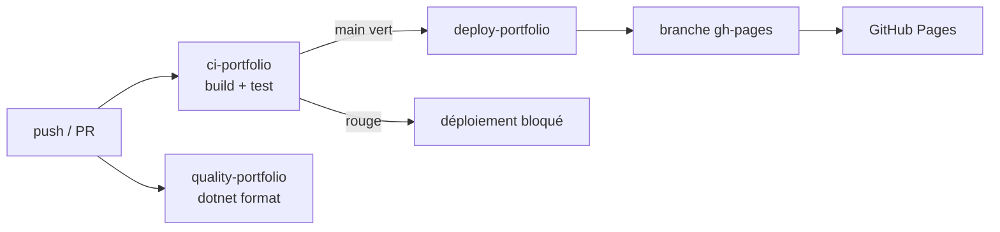

# Phase 11 — Documentation générale & README

## Objectif

Mettre la documentation du projet au niveau de la refonte technique réalisée (phases 01→10) :

1. **Commenter le code** sur les décisions stratégiques (le *pourquoi*), pas les appels triviaux.
2. **Réécrire le README**, devenu obsolète, pour refléter l'état réel du projet.
3. **Ajouter 4 schémas Mermaid** au README : structure du site, CI/CD, workflow Git, process de dev.

## Prérequis

- Phases 01→10 mergées sur `feature/redesign-portfolio` (refonte complète intégrée).
- Aucun changement de comportement : cette phase ne touche **que** la documentation (commentaires + README). Le code applicatif n'est pas modifié.

## Contexte

Le README date d'avant la refonte : il annonce **.NET 8**, une structure de pages périmée (`Home/Experiences/Projects/Educations`), un `scroll.js` qui n'existe plus, et ignore le blog, le design system (tokens dark/light, fonts self-hosted) et la CSP. En parallèle, le code C# est propre et idiomatique mais **quasi dépourvu de commentaires explicatifs** : les choix non évidents (sécurité, cache, lifecycle Blazor) ne sont documentés nulle part.

### Décisions de cadrage (validées)

- **Style des commentaires** : commentaires inline `//` courts, en français, **uniquement sur les décisions non évidentes**. Zéro commentaire trivial (« appel au service »).
- **Format des schémas** : **Mermaid** (rendu nativement par GitHub, versionné en texte, pas d'image binaire).

## Étapes

### 11.1 — Commentaires stratégiques du code

Ajouter des commentaires inline ciblés sur les *pourquoi* identifiés lors de l'audit. Liste de référence (à compléter après lecture des fichiers restants) :

| Fichier | Décision à expliquer |
|---------|----------------------|
| `Services/BlogService.cs` | `_slugRegex` = garde **anti-path-traversal** avant de construire `posts/{slug}.md` |
| `Services/BlogService.cs` | `.DisableHtml()` du pipeline Markdig = garde **anti-XSS**, cohérence CSP |
| `Services/BlogService.cs` | Cache mémoire `_cachedArticles` (index chargé une seule fois) |
| `Services/ExperienceService.cs` · `ProjectService.cs` · `StackService.cs` | Cache mémoire + `catch (HttpRequestException) → []` (résilience : pas de crash si JSON absent) |
| `Components/Nav/Nav.razor.cs` | JS interop en `OnAfterRenderAsync(firstRender)` (DOM requis) ; ordre du `DisposeAsync` (module JS avant `DotNetObjectReference`) |
| `Components/Nav/ThemeToggle.razor.cs` | Thème par défaut `dark`, lu depuis `localStorage` via `theme.js` en `OnAfterRender` |
| `Services/UIStateService.cs` | Service Scoped observable (`OnChange`) : partage l'état du menu mobile entre `Nav` et `MobileMenu` |
| `Pages/Blog.razor.cs` · `BlogPost.razor.cs` | Gestion `_notFound` / slug invalide |
| `Program.cs` | Lifetimes DI (services Scoped) + `HttpClient` `BaseAddress` = `HostEnvironment.BaseAddress` |

**Règle** : si un bout de code est évident à la lecture, on ne le commente pas.

### 11.2 — Réécriture du README

Corrections et ajouts :

- **Stack** : .NET 8 → **.NET 10** (badge + tableau), ajout de Markdig (blog), fonts self-hosted, CSP.
- **Architecture** : nouvelle arborescence (`Components/Nav|Sections|Common`, `Layout`, `Pages` = `Index/Blog/BlogPost`, `Services`, `wwwroot/css|fonts|js|posts|data`).
- **Choix structurants** : design system CSS à tokens dark/light (pas de framework), fonts self-hosted (zéro requête externe), CSP stricte (`csp-security.md`), blog Markdown statique (Markdig).
- **JS** : `theme.js` + `scroll-spy.js` (et non `scroll.js`), chargés en modules ES via `IJSRuntime`.
- **Données dynamiques** : tableau `stack/experiences/projects/educations.json` + `posts/`.
- **CI/CD** : décrire les 3 workflows (`ci-portfolio`, `quality-portfolio`, `deploy-portfolio`).
- **Badge Deploy** : conserver, vérifier l'URL.

### 11.3 — Schémas Mermaid (4)

1. **Structure du site** — arborescence logique : `index.html` → `App` → `MainLayout` → `Nav` + `Pages` → `Sections` → `Services` → `wwwroot/data|posts`.
2. **CI/CD** — `flowchart` : `push`/`PR` → `ci-portfolio` (build+test) & `quality-portfolio` (format) ; sur `main` vert → `deploy-portfolio` → `gh-pages` → GitHub Pages.
3. **Workflow Git** — `gitGraph` : `main`, branche d'intégration `feature/redesign-portfolio`, branches de phase `feature/redesign-pXX`, merge commit vers l'intégration / rebase vers `main`.
4. **Process de dev** — `flowchart` : brancher → implémenter → `build` → `test` → `review` → commit → push → PR → merge (cf. `git-workflow.md`).

Esquisse du schéma CI/CD (direction validée) :

## Conventions

- Commentaires et README en **français**, termes techniques en anglais.
- Aucun changement de code applicatif (diff = commentaires + `README.md` + ce plan).
- `dotnet build` + `dotnet test` doivent rester verts (sanity check, le code ne change pas).

## Branche & commits

- Branche : `docs/documentation-refonte` (depuis `feature/redesign-portfolio`).
- Commits séparés par unité logique :
  - `docs: commenter les décisions stratégiques du code (sécurité, cache, lifecycle)`
  - `docs: réécrire le README pour la refonte (.NET 10, blog, design system, CI/CD)`
- PR vers `feature/redesign-portfolio`.

## Checklist finale

- [ ] Commentaires inline ajoutés sur tous les *pourquoi* du tableau 11.1
- [ ] Aucun commentaire trivial introduit
- [ ] README à jour (.NET 10, structure, blog, design system, CSP, JS, données, CI/CD)
- [ ] 4 schémas Mermaid présents et rendus correctement (preview GitHub)
- [ ] `dotnet build` + `dotnet test` verts
- [ ] Badges du README valides

## Hors scope

- Documentation API / XML doc (`///`) — non retenu (style inline ciblé validé).
- Schémas en image binaire (PNG/SVG) — Mermaid retenu.
- Toute modification du comportement applicatif.
