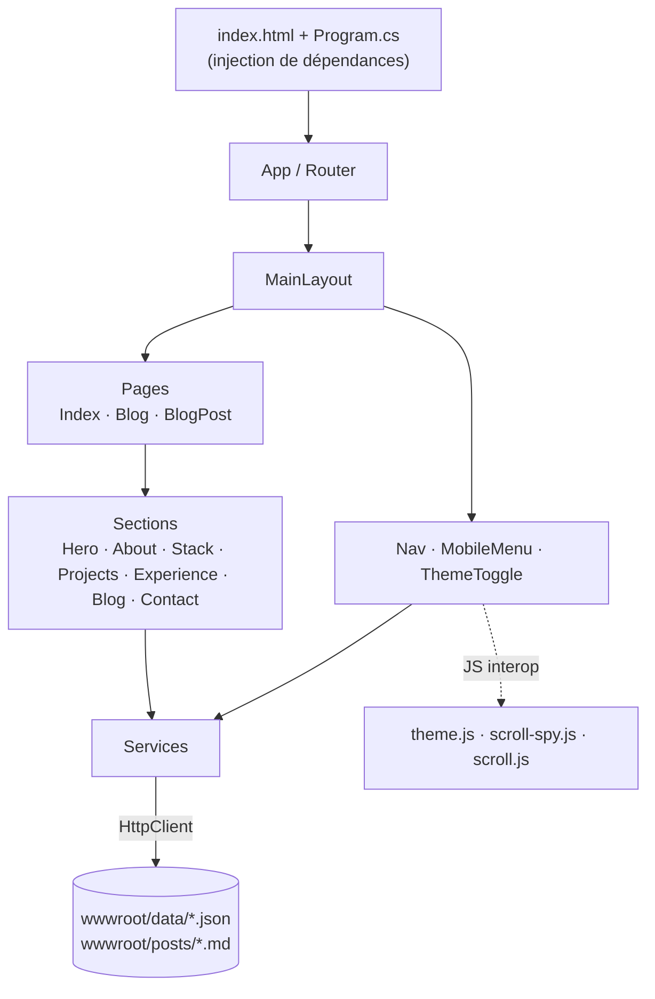
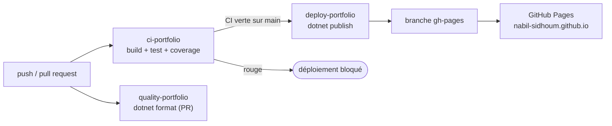
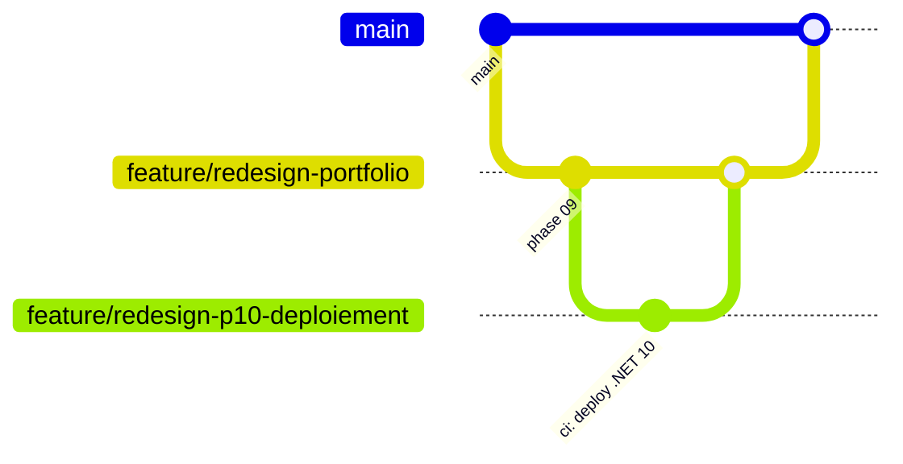
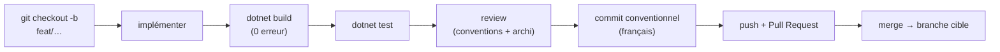
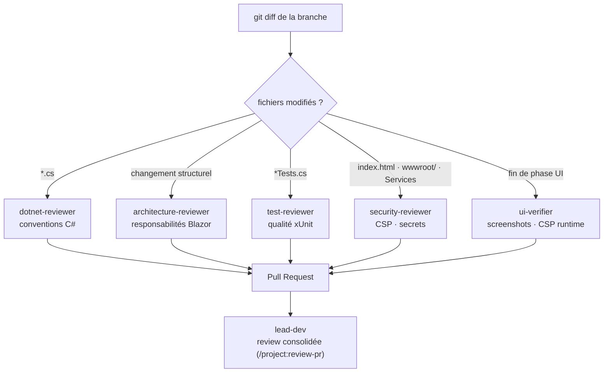

<div align="center">

# Portfolio — Nabil Sidhoum

**Tech Lead .NET** · [nabil-sidhoum.github.io](https://nabil-sidhoum.github.io)

[](https://github.com/nabil-sidhoum/nabil-sidhoum.github.io/actions/workflows/deploy-portfolio.yml)


*Ce portfolio est lui-même un projet technique : une SPA Blazor WebAssembly, sans backend ni API externe, déployée automatiquement sur GitHub Pages via GitHub Actions.*

</div>

---

## 🧱 Stack technique

| Couche | Technologie |
|---|---|
| Framework | .NET 10 / Blazor WebAssembly (standalone) |
| UI / Style | Design system CSS maison à tokens — thème **dark / light**, zéro framework |
| Fonts | JetBrains Mono + IBM Plex Sans — **self-hosted** (aucune requête externe) |
| Blog | Articles Markdown rendus via **Markdig** |
| Tests | xUnit + RichardSzalay.MockHttp |
| CI/CD | GitHub Actions (3 workflows) |
| Hébergement | GitHub Pages (branche `gh-pages`) |
| Sécurité | CSP stricte (`<meta>`) + `_headers` prêt pour Cloudflare |

---

## 🗂️ Architecture

```
src/
├── BlazorPortfolio.Client/
│   ├── Components/
│   │   ├── Nav/         # Nav, MobileMenu, ThemeToggle
│   │   ├── Sections/    # Hero, About, Stack, Projects, Experience, Blog, Contact…
│   │   └── Common/      # PathStrip, Footer
│   ├── Layout/          # MainLayout
│   ├── Models/          # ProjectInfo, ExperienceInfo, BlogArticle, StackCategoryInfo
│   ├── Pages/           # Index, Blog, BlogPost
│   ├── Services/        # ProjectService, ExperienceService, StackService,
│   │                    # BlogService, UIStateService
│   └── wwwroot/
│       ├── css/         # theme.css (tokens dark/light, reset, utilitaires)
│       ├── fonts/       # JetBrains Mono + IBM Plex Sans (.woff2)
│       ├── js/          # theme.js, scroll-spy.js, scroll.js (modules ES)
│       ├── data/        # stack / experiences / projects / educations .json
│       └── posts/       # index.json + articles .md (blog)
└── BlazorPortfolio.Client.Tests/   # tests unitaires des services
```

### 🔭 Comment c'est structuré



### Choix structurants

**📦 Données en JSON statique** — `stack`, `experiences`, `projects`, `educations` et les articles du blog sont servis statiquement depuis `wwwroot/` et consommés via `HttpClient`. Le code applicatif respecte le même contrat qu'une vraie API REST : il ne sait pas d'où viennent les données, seulement comment les consommer. **Ajouter du contenu = éditer un JSON, pas le code.**

**🎨 Design system maison** — un fichier `theme.css` central porte les tokens (couleurs, espacements, typo) et gère le thème dark/light ; chaque composant embarque son `.razor.css` scopé. Aucune librairie CSS externe.

**🔤 Fonts self-hosted** — JetBrains Mono et IBM Plex Sans sont servies depuis `wwwroot/fonts/`. Zéro appel à Google Fonts, cohérent avec une CSP stricte.

**⚡ JS minimal en modules ES** — trois petits modules (`theme.js`, `scroll-spy.js`, `scroll.js`) chargés via `IJSRuntime`, jamais de globaux ni de script inline.

**🔒 Sécurité par défaut** — CSP stricte, validation des slugs du blog (anti-path-traversal), Markdown sans HTML brut (anti-XSS). Voir [`.claude/rules/csp-security.md`](.claude/rules/csp-security.md).

---

## 🔄 Données dynamiques

| Fichier | Modèle | Service | Affiché par |
|---|---|---|---|
| `data/stack.json` | `StackCategoryInfo` | `StackService` | StackSection |
| `data/experiences.json` | `ExperienceInfo` | `ExperienceService` | ExperienceSection |
| `data/projects.json` | `ProjectInfo` | `ProjectService` | ProjectsSection |
| `posts/index.json` + `posts/*.md` | `BlogArticle` | `BlogService` | Blog · BlogPost |

> `data/educations.json` est présent dans le dépôt mais n'est pas encore affiché (pas de section dédiée).

---

## 🚀 CI/CD

Trois workflows GitHub Actions, déclenchés selon le contexte :



| Workflow | Déclencheur | Rôle |
|---|---|---|
| `ci-portfolio` | push & PR | `dotnet build` + `dotnet test` (+ couverture) |
| `quality-portfolio` | PR | `dotnet format --verify-no-changes` (conventions C#) |
| `deploy-portfolio` | après CI **verte** sur `main` | `dotnet publish` → fallback `404.html` → push sur `gh-pages` |

Le déploiement est **découplé** de la CI (`workflow_run`) : on ne publie que du code déjà vérifié. La version du SDK est pilotée par `src/global.json`.

---

## 🌿 Workflow Git

Modèle **une branche par unité de travail**, jamais de commit direct sur les branches protégées — tout passe par Pull Request. La refonte a suivi un modèle **branche par phase** mergée sur une branche d'intégration, elle-même rebasée sur `main`.



- `main` : stable, déployée. Push direct interdit, **merge rebase uniquement** (historique linéaire).
- Branches de travail : `feat/*`, `fix/*`, `docs/*`, `ci/*`, `refactor/*`, `chore/*`.

Politique complète : [`.claude/rules/git-workflow.md`](.claude/rules/git-workflow.md).

---

## 🛠️ Process de développement



### 🤖 Review automatisée par agents

L'étape *review* ne dépend pas de la bonne volonté : selon les fichiers présents dans le diff, des **sous-agents Claude Code spécialisés** sont déclenchés automatiquement, chacun avec un périmètre précis. `lead-dev` orchestre une review consolidée avant le merge.



| Agent | Déclenché par | Rôle |
|---|---|---|
| `dotnet-reviewer` | modification de `*.cs` | Conventions C# (style, patterns) |
| `architecture-reviewer` | changement structurel | Séparation des responsabilités Blazor |
| `test-reviewer` | présence de `*Tests.cs` | Qualité des tests xUnit (AAA, mocks) |
| `security-reviewer` | `index.html`, `wwwroot/`, Services | Sécurité Blazor WASM, CSP, secrets |
| `ui-verifier` | fin d'une phase UI | Vérification visuelle + CSP runtime (screenshots) |
| `lead-dev` | review de PR complète | Orchestration et synthèse des reviewers |

> Les définitions de ces agents vivent hors dépôt (`.claude/agents/`, non versionné) : le schéma documente le *process* de qualité, pas un outillage réutilisable en l'état.

### Commandes essentielles

```bash
# Dev local
dotnet run --project src/BlazorPortfolio.Client

# Tests unitaires
dotnet test src/BlazorPortfolio.Client.Tests/BlazorPortfolio.Client.Tests.csproj

# Build production
dotnet publish src/BlazorPortfolio.Client/BlazorPortfolio.Client.csproj -c Release -o build

# Vérifier les conventions (sans modifier)
dotnet format src/BlazorPortfolio.slnx --verify-no-changes
```

---

## 🧪 Tests

```bash
dotnet test src/BlazorPortfolio.Client.Tests/BlazorPortfolio.Client.Tests.csproj
```

| Cas testé | Description |
|---|---|
| ✅ Nominal | Désérialisation JSON correcte → collection non vide |
| ✅ Erreur HTTP | 404 → collection vide, sans exception |
| ✅ Mapping | Cohérence modèle / JSON (`Assert.Equal`) |
| ✅ Tri | Expériences triées par date décroissante |

---

## 🔒 Sécurité

La CSP active en production passe par une balise `<meta http-equiv="Content-Security-Policy">` dans `index.html` (Blazor WASM standalone, sans serveur). Le fichier `wwwroot/_headers` porte les headers qu'une balise `<meta>` ne peut pas (`X-Frame-Options`, `Permissions-Policy`, `HSTS`…) ; il est **inerte sur GitHub Pages** et ne s'activera qu'après une éventuelle migration vers Cloudflare Pages.

Détail de la posture : [`.claude/rules/csp-security.md`](.claude/rules/csp-security.md).

---

## 🔍 Qualité du code

`.editorconfig` appliqué par `dotnet format` + analyseurs Roslyn :

- Indentation 4 espaces · fin de ligne CRLF
- Types explicites — pas de `var`
- Champs privés en `_camelCase`, modificateurs d'accès explicites
- Pattern code-behind Blazor (`.razor` markup pur, logique en `.razor.cs`)
- Chaque diagnostic désactivé est **documenté et justifié**

---

## 📜 Licence

MIT — voir [LICENSE](LICENSE).
