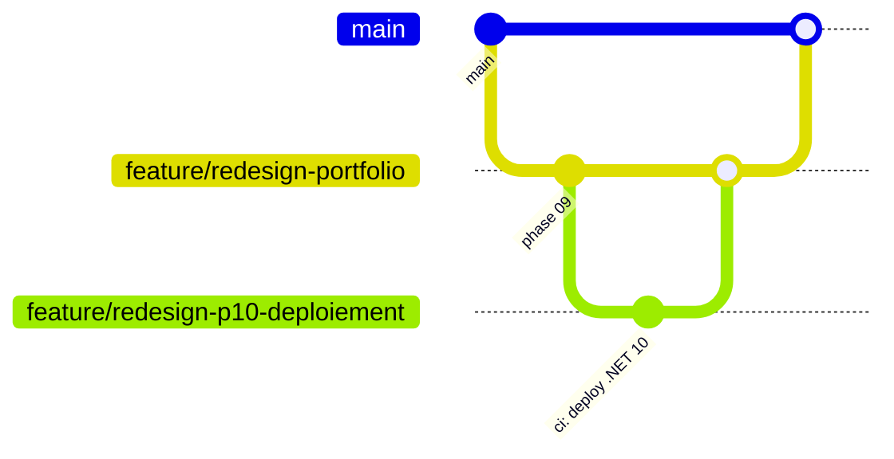

# Historique — Refonte du portfolio (2026)

> Mémoire de l'opération de refonte menée puis clôturée en **juin 2026**. Ce document est figé : il décrit ce qui a été fait, pas l'état courant du projet (voir `CLAUDE.md` pour l'opérationnel).

## Contexte & objectif

Refonte complète du portfolio personnel :

- **Migration vers .NET 10 / Blazor WebAssembly** (standalone, sans backend).
- **Design system maison** : tokens CSS dark/light, fonts self-hosted (JetBrains Mono + IBM Plex Sans), zéro framework CSS externe.
- **Données dynamiques** externalisées en JSON statique (`stack`, `experiences`, `projects`, `educations`) + blog en Markdown (Markdig).
- **Sécurité** : Content Security Policy stricte via `<meta>`, `_headers` prêt pour Cloudflare.
- **CI/CD** : trois workflows GitHub Actions (`ci-portfolio`, `quality-portfolio`, `deploy-portfolio`), déploiement découplé de la CI.

## Modèle de travail employé — une branche par phase

La refonte a été découpée en **phases**, chacune développée sur sa propre branche et mergée (merge commit) dans une **branche d'intégration** `feature/redesign-portfolio`. Cette branche d'intégration a finalement été rebasée sur `main` pour préserver un historique linéaire.

```
feature/redesign-portfolio        ← branche d'intégration (base et cible de toutes les PR de phase)
  └── feature/redesign-p01-preparation
  └── feature/redesign-p02-design-system
  └── feature/redesign-p03-navigation
  └── feature/redesign-p04-hero-about
  └── feature/redesign-p05-stack-projects
  └── feature/redesign-p06-experience-blog-contact
  └── feature/redesign-p07-blog-routing
  └── feature/redesign-p08-securite-csp
  └── feature/redesign-p09-polish-qa
  └── feature/redesign-p10-deploiement
```



### Process suivi pour chaque phase (ordre strict)

```
1. git checkout feature/redesign-portfolio && git pull
2. git checkout -b feature/redesign-pXX-nom
3. Implémenter la phase
4. dotnet build        → 0 erreur obligatoire avant de continuer
5. dotnet test         → si des tests existent pour cette phase
6. ui-verifier         → screenshots dans .claude/screenshots/phase-XX-nom/ (phases UI uniquement)
7. /project:review     → dotnet-reviewer + architecture-reviewer sur les fichiers modifiés
8. git commit          → un commit par phase (sauf phase trop volumineuse), commits feat/docs distincts
9. git push + PR vers feature/redesign-portfolio
```

## Déroulé des phases

| Phase | Branche | Statut |
|-------|---------|--------|
| 01 — Préparation repo | `feature/redesign-p01-preparation` | ✅ Mergée (PR #8) |
| 02 — Design system (tokens CSS + fonts) | `feature/redesign-p02-design-system` | ✅ Mergée (PR #9) |
| 03 — Layout + navigation | `feature/redesign-p03-navigation` | ✅ Mergée (PR #10) |
| 04 — Hero + About | `feature/redesign-p04-hero-about` | ✅ Mergée (PR #11) |
| 05 — Stack + Projects | `feature/redesign-p05-stack-projects` | ✅ Mergée (PR #12) |
| 06 — Experience + Blog + Contact | `feature/redesign-p06-experience-blog-contact` | ✅ Mergée (PR #14) |
| 07 — Blog routing (Markdig) | `feature/redesign-p07-blog-routing` | ✅ Mergée (PR #15) |
| 08 — Sécurité CSP | `feature/redesign-p08-securite-csp` | ✅ Mergée (PR #16) |
| 09 — Polish + QA | `feature/redesign-p09-polish-qa` | ✅ Mergée (PR #18) |
| 10 — Déploiement (`deploy-portfolio`) | `feature/redesign-p10-deploiement` | ✅ Mergée (PR #21) |
| 11 — Documentation | `docs/documentation-refonte` | ✅ Mergée (PR #22) |
| **Clôture — Intégration → `main`** | `feature/redesign-portfolio` | ✅ Mergée (PR #23, *rebase*) |

> Détail des plans de chaque phase : `.claude/plans/00-plan-maitre.md` et `.claude/plans/XX-*.md` (archives de planification).

## Clôture (juin 2026)

La branche d'intégration a été mergée sur `main` via la **PR #23**, en **« Rebase and merge »** : les ~36 commits de phase ont été rejoués en ligne droite (les 15 commits de merge éliminés), respectant la contrainte d'historique linéaire du ruleset `Protect main`. Le contenu final était strictement identique à la branche d'intégration (vérifié avant merge).

Opérations de clôture exécutées ensuite :

1. **Déploiement** vérifié vert (`deploy-portfolio`) et site en production (HTTP 200).
2. **Status checks requis** ajoutés sur `main` : `build-and-test` + `Conventions C# (dotnet format)`.
   - ⚠️ `deploy-portfolio` **n'a pas** été rendu requis : il se déclenche en `workflow_run` post-merge sur `main` et ne tourne jamais sur le commit d'une PR — le rendre obligatoire aurait verrouillé toutes les PR.
3. **Ruleset `Protect redesign integration`** (id `17370581`) supprimé.
4. **Branche d'intégration** `feature/redesign-portfolio` supprimée (distante + locale).

À la fin de l'opération, il ne reste qu'un seul ruleset actif (`Protect main`) et un modèle de branches standard (une branche de travail par unité logique, cible `main`).
